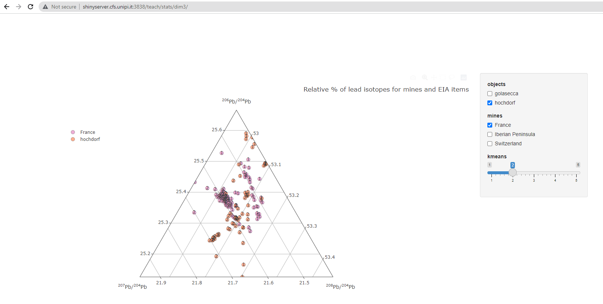
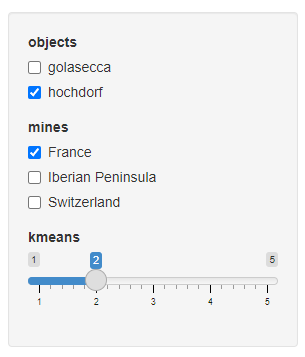
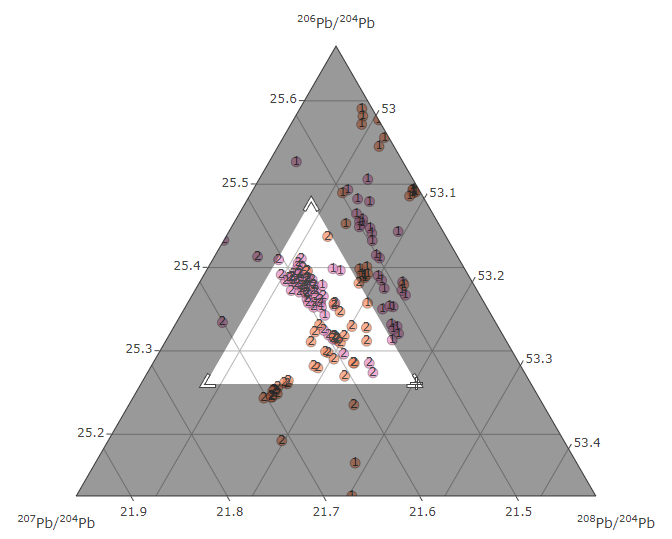
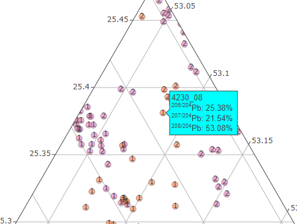

# ***itineRis*** 

R package of the [ANR-Itineris](https://github.com/ANR-Itineris/itineris#anr-itineris-)

# Install and load package

Install the R package

```
devtools::install_github("zoometh/itineRis")
```

And load the package

```
library(itineRis)
```

By default, output will be saved in the `results/` folder. You can change the output folder by changing the `dirOut` option in the various functions.


# interactive ternary plot of LIA
> Create an interactive ternary plot, with plotly, to visualise the results of lead isotopic analysis (LIA)

Create an hash object to store 

```
d <- hash::hash()
```

Read the LIA measures for objects and mines

```
d <- read_lia(d = d,
              d.tag = "lia.objects",
              df.path = "C:/Rprojects/itineRis/results/LIA data objects.xlsx",
              header.line = 2)
d <- read_lia(d = d,
              d.tag = "lia.mines",
              pattern.objects.num = "Locality/.Mine",
              pattern.objects.Pb206_Pb204 = "206Pb/204Pb",
              pattern.objects.Pb207_Pb204 = "207Pb/204Pb",
              pattern.objects.Pb208_Pb204 = "208Pb/204Pb",
              df.path = "C:/Rprojects/itineRis/results/Coordinates-mines_Thomas Huet.xlsx",
              header.line = 1)
```
Group the datasets, assign colors and symbols

```
library(dplyr)

mydf <- rbind(d$lia.mines, d$lia.objects)
df.isotop <- isotop_dataframe(df = mydf, df.path = NA)
df.isotop[df.isotop$object == "golasecca", "color.object"] <- "#0000FF"
df.isotop[df.isotop$object == "hochdorf", "color.object"] <- "#00FFFF"
df.isotop[df.isotop$object == "France", "color.object"] <- "#FF0000"
df.isotop[df.isotop$object == "France", "symbol"] <- "triangle"
df.isotop[df.isotop$object == "Iberian Peninsula", "color.object"] <- "#FFA500"
df.isotop[df.isotop$object == "Iberian Peninsula", "symbol"] <- "triangle"
df.isotop[df.isotop$object == "Switzerland", "color.object"] <- "#964B00"
df.isotop[df.isotop$object == "Switzerland", "symbol"] <- "triangle"
```

Create a ternary plot

```
isotop_ternaryplot(df.isotop)
```


Create a Plotly plot (3D interactive) where LIA measurements of objects and mines are displayed

```
isotop_3d(df.isotop,
          vars = c("Pb206_Pb204", "Pb207_Pb204", "Pb208_Pb204"),
          marker.size = 5,
          export.plot = T,
          out.plot = "isotop_3d.html",
          dirOut = "C:/Rprojects/itineRis/results/")
```

## In Shiny

A similar function is hosted on a Shiny Server: http://shinyserver.cfs.unipi.it:3838/teach/stats/stats/dim3/

<p align="center">
  
  <br>
    <em>landing page of the interactive <a href="http://shinyserver.cfs.unipi.it:3838/teach/stats/dim3/">Shiny ternary plot</a> </em>
</p>

The parameters (`objects`, `mines`, `kmeans`) can be selected with the input box:

  - `objects`: categories of objects (by default `golasecca` or `hordorf`)
  - `mines`: mines' countries (by default `France`, `Iberian Peninsula`, or `Switzerland`) 
  - `kmeans`: number of Kmeans[^1] centers, or clusters (by default between `1` to `5`)

<p align="center">
  
  <br>
    <em>input selection</em>
</p>

Use the Zoom tool to select a region of interest in the graph (to zoom out, double click).

<p align="center">
  
  <br>
    <em>Zoom in</em>
</p>

The Zoom tool, the Span tool and the Hover info allow you to view the results sample by sample.

<p align="center">
  
  <br>
    <em>hover info for the sample `4230_08` allocated to the cluster `1`</em>
</p>

Each sample is tagged with the number of the Kmeans cluster to which it belongs. 

## A simplier example...


```
library(dplyr)

df.isotop <- isotop_dataframe(
  df.path = paste0("C:/Rprojects/itineRis/inst/extdata/isotop_results.tsv"),
  color.column = "object"
)

isotop_3d(df.isotop,  
          vars = c("Pb206_Pb204", "Pb207_Pb204", "Pb208_Pb204"),
          export.plot = T,
          out.plot = "isotop_3d.html",
          dirOut = "C:/Rprojects/itineRis/results/")
```

Gives:


<center>
  

https://zoometh.github.io/itineRis/results/isotop_3d
  
</center>

# Interactive map of mines

Create an interactive leaflet map of mines

```
d <- hash::hash()
d <- read_mines(d = d,
                df.path = "C:/Rprojects/itineRis/results/Coordinates-mines_Thomas Huet.xlsx")
map_leaflet(d = d,
            d.coords = "mines.coords",
            export.plot = T,
            out.plot = "map_sites.html",
            dirOut = "C:/Rdev-itineris/itineris/data/")
```

Gives:
  
<center>
  

https://zoometh.github.io/itineRis/results/map_sites.html
  
</center>

## Thesaurus

The function `thesaurus()` creates interactive graphs to display the thesaurus of the project

```
thes <- "https://raw.githubusercontent.com/ANR-Itineris/itineris/main/lod/thesaurus/Itineris_th101.rdf"
thesaurus(root = "artefact",
          outPlot = "collapsibleTree",
          export.plot = T,
          outDir = "C:/Rprojects/itineRis/results/")
```

<center>
  

https://zoometh.github.io/itineRis/results/artefact
  
</center>


---

[^1]: the Kmeans (R function `kmeans()`) is run on the selected `objects` and `mines`. It tags every sample with the number of its cluster ()

